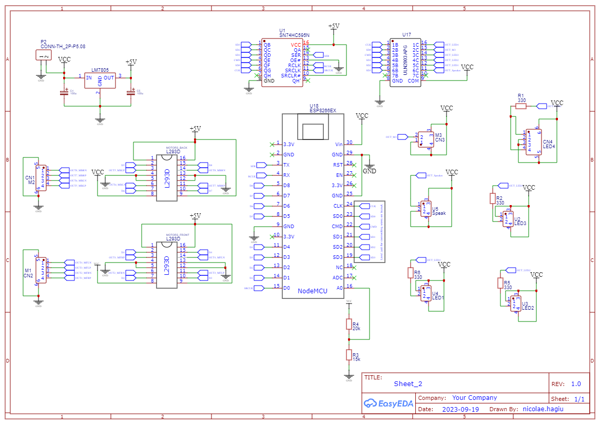
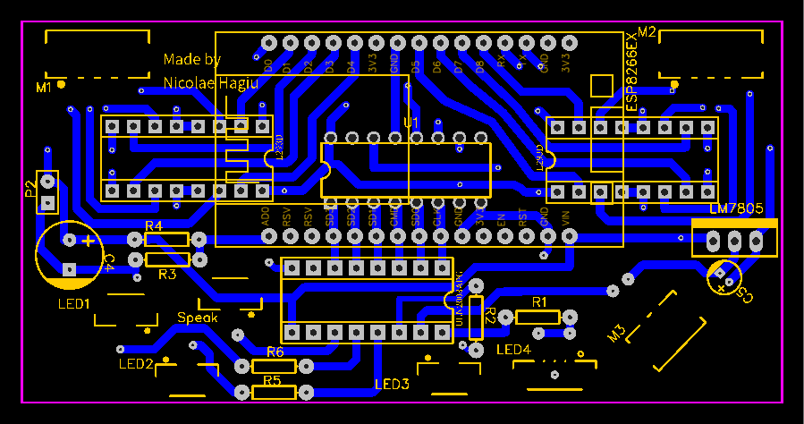
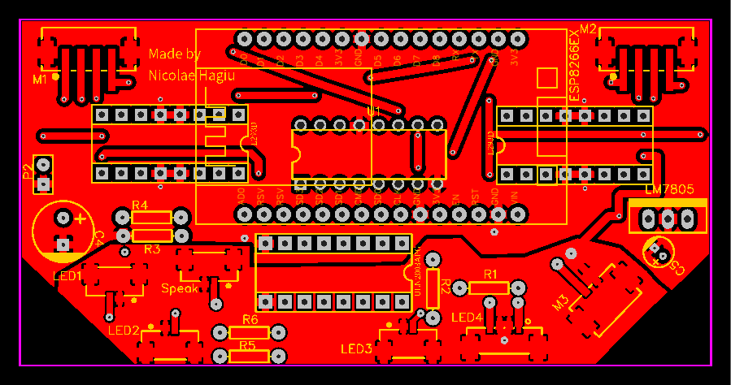
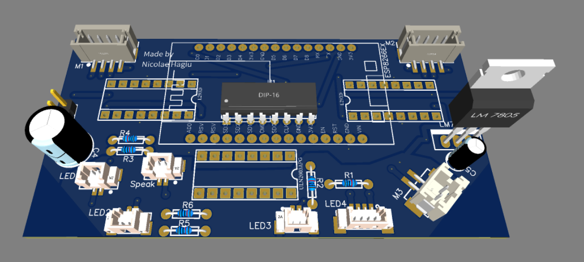

# Hardware Documentation for RC_ESP8266

## Table of Contents
1. [Schematic](#schematic)
2. [PCB Layout](#pcb-layout)
3. [3D View](#3d-view)

## Schematic

### ESP8266 Arduino Board
The ESP8266 is a low-cost Wi-Fi microchip with full TCP/IP stack and microcontroller capability, produced by Espressif Systems. It is widely used in IoT projects due to its affordability and ease of use. The ESP8266 can be programmed using the Arduino IDE, making it accessible for beginners and hobbyists. It features GPIO pins, PWM, ADC, and supports various communication protocols like SPI, I2C, and UART.

### L293D Integrated Circuit
The L293D is a quadruple high-current half-H driver designed to provide bidirectional drive currents of up to 600 mA at voltages from 4.5 V to 36 V. It is commonly used to drive inductive loads such as relays, solenoids, DC and stepping motors. The L293D can control two DC motors or one stepper motor, making it a versatile choice for motor control applications.

#### Principle Properties:
- **Dual H-Bridge**: Each channel can drive a motor independently, allowing for forward and reverse motion.
- **High Current Capability**: Can handle up to 600 mA of continuous current per channel.
- **Wide Supply Voltage Range**: Operates from 4.5 V to 36 V, suitable for various motor types.
- **Thermal Shutdown**: Protects the IC from overheating.
- **Internal Clamp Diodes**: Protects against back EMF generated by inductive loads.
- **Enable Pins**: Allows for easy control of motor operation.

The L293D is widely used in robotics and automation projects due to its robustness and ease of use.

### LM7805 Voltage Regulator
The LM7805 is a popular voltage regulator integrated circuit (IC) that provides a stable 5V output from a higher voltage input. It is widely used in electronic circuits to ensure a consistent voltage supply to components.

#### Principle Properties:
- **Fixed Output Voltage**: Provides a stable 5V output.
- **Input Voltage Range**: Can accept input voltages from 7V to 35V.
- **Current Capability**: Can supply up to 1.5A of output current.
- **Thermal Overload Protection**: Shuts down the regulator if it overheats.
- **Short Circuit Protection**: Protects the regulator and connected components from damage due to short circuits.
- **Low Quiescent Current**: Consumes minimal current when not supplying load.

The LM7805 is commonly used in power supply circuits for microcontrollers, sensors, and other electronic components that require a stable 5V supply.

### SN74HC595 Shift Register
The SN74HC595 is an 8-bit serial-in, parallel-out shift register with output latches. It is commonly used to expand the number of output pins available on a microcontroller, allowing for control of multiple outputs with fewer input pins.

#### Principle Properties:
- **8-bit Shift Register**: Allows for serial input and parallel output of 8 bits.
- **Output Latches**: Latches the output data, ensuring stable output until the next update.
- **High-Speed Operation**: Can operate at high frequencies, suitable for fast data transfer.
- **Wide Supply Voltage Range**: Operates from 2V to 6V, compatible with various logic levels.
- **Low Power Consumption**: Consumes minimal power, making it suitable for battery-operated devices.
- **Cascadable**: Multiple SN74HC595 ICs can be cascaded to control more outputs.

The SN74HC595 is widely used in applications such as LED displays, keypads, and other devices requiring multiple output controls.

### ULN2003A Darlington Transistor Array
The ULN2003A is a high-voltage, high-current Darlington transistor array. It consists of seven NPN Darlington pairs that feature high-voltage outputs with common-cathode clamp diodes for switching inductive loads. The ULN2003A is commonly used to drive relays, lamps, and stepper motors.

#### Principle Properties:
- **High Current Capability**: Each Darlington pair can handle up to 500 mA of continuous current.
- **High Voltage Tolerance**: Can withstand voltages up to 50V.
- **Integrated Clamp Diodes**: Protects against voltage spikes from inductive loads.
- **Input Compatibility**: Compatible with TTL and 5V CMOS logic levels.
- **Common-Cathode Diodes**: Simplifies the design for driving inductive loads.
- **Versatile Applications**: Suitable for driving relays, lamps, and stepper motors.

The ULN2003A is widely used in various applications, including relay driving, LED displays, and motor control, due to its robustness and ease of use.

## PCB Layout

*Description of the PCB layout.*

## 3D View

*Description of the 3D view of the PCB.*
